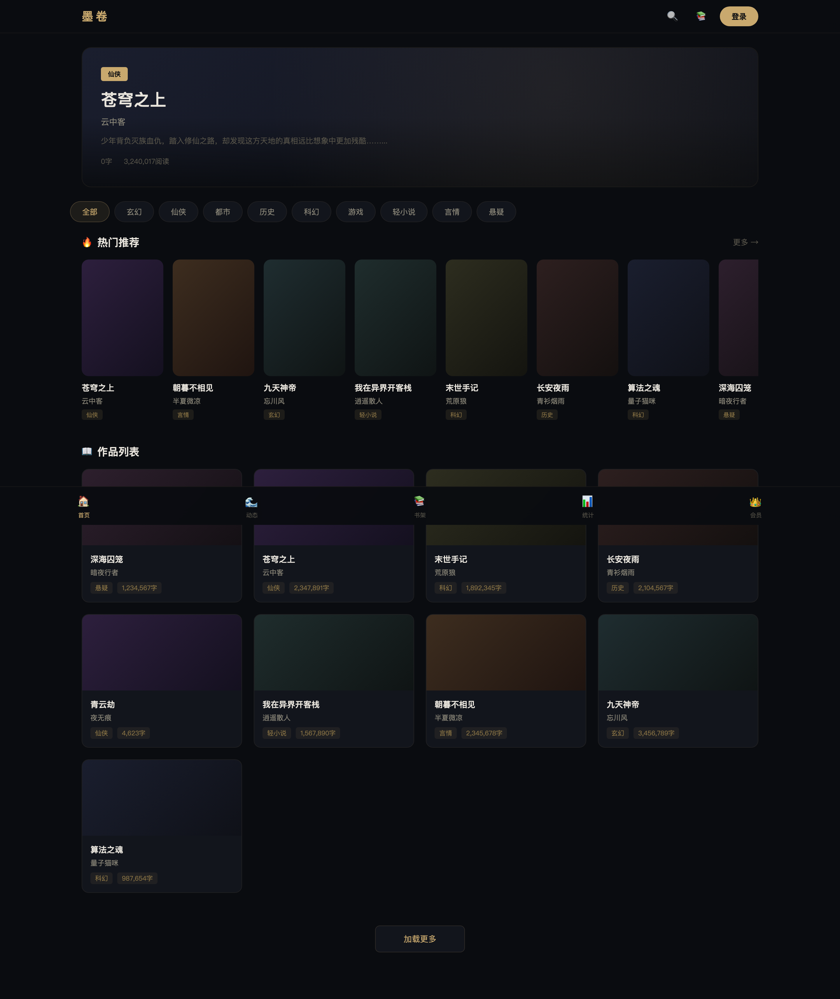
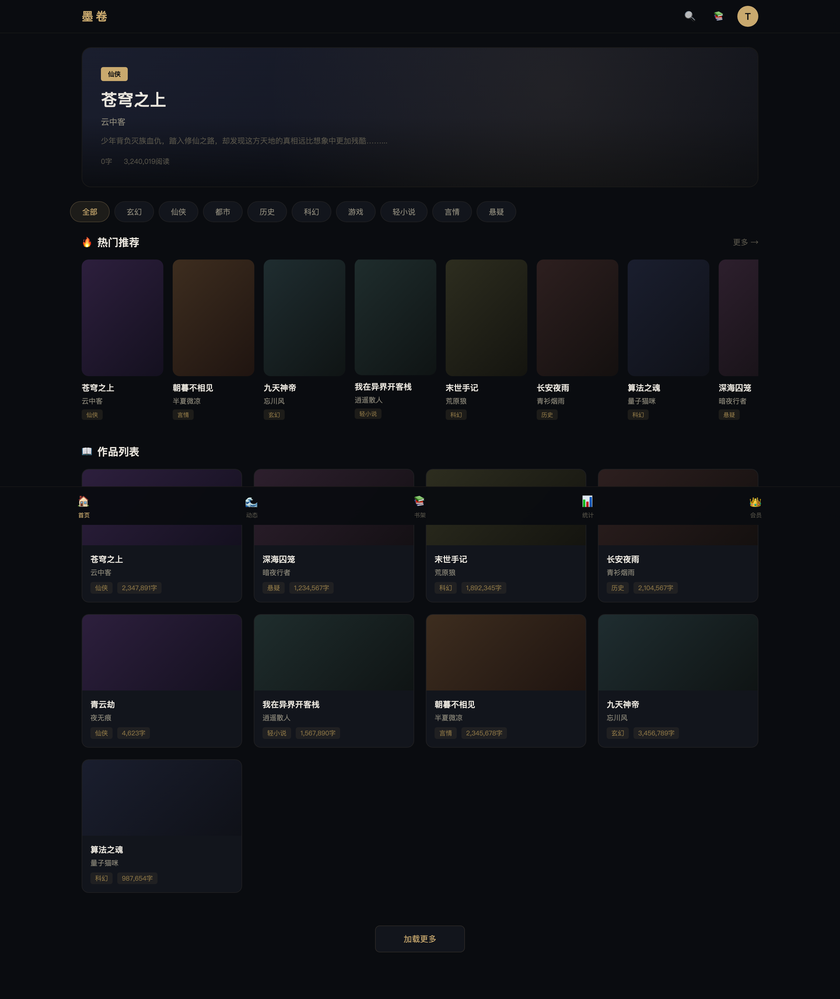
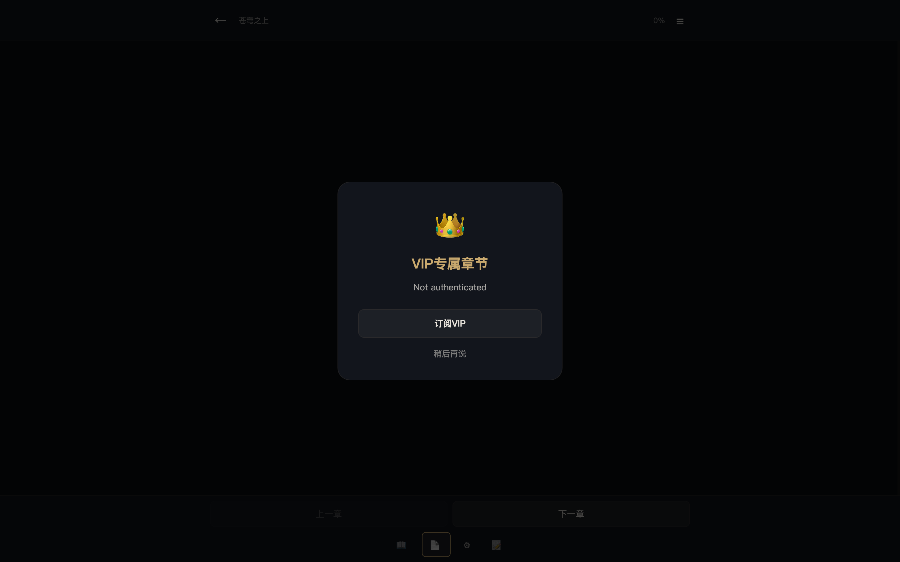
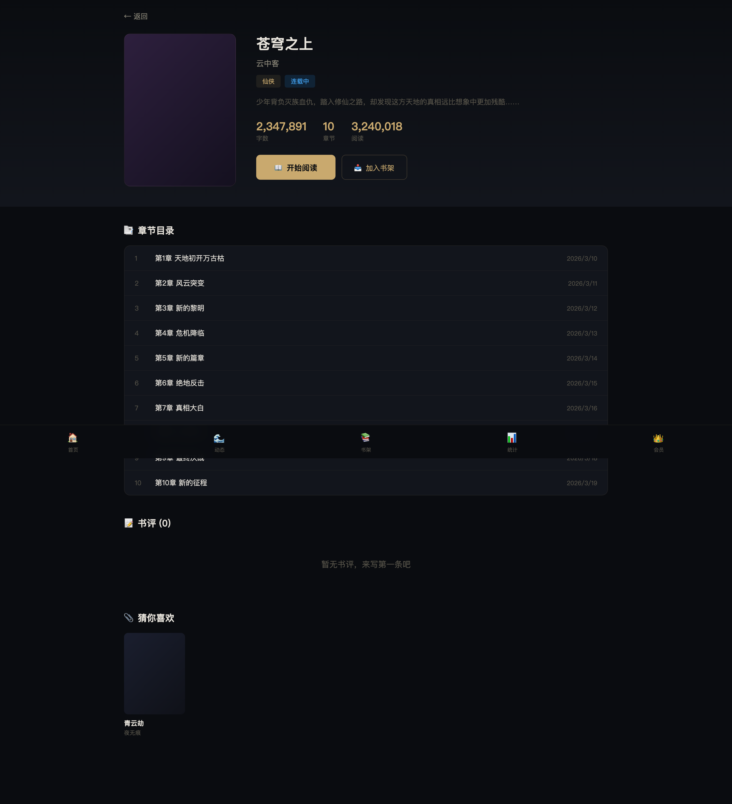
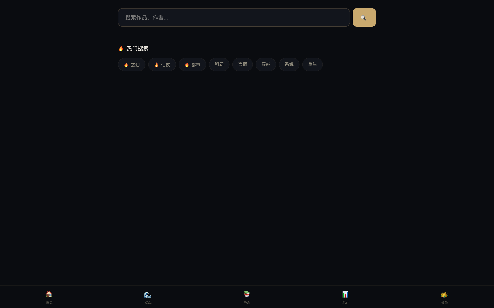
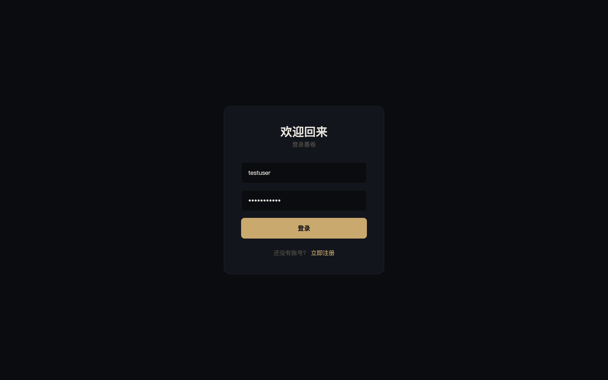
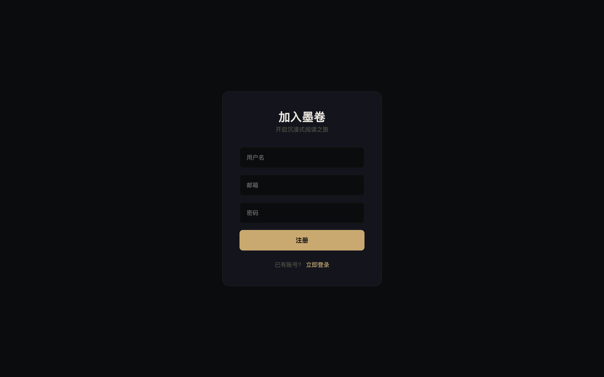
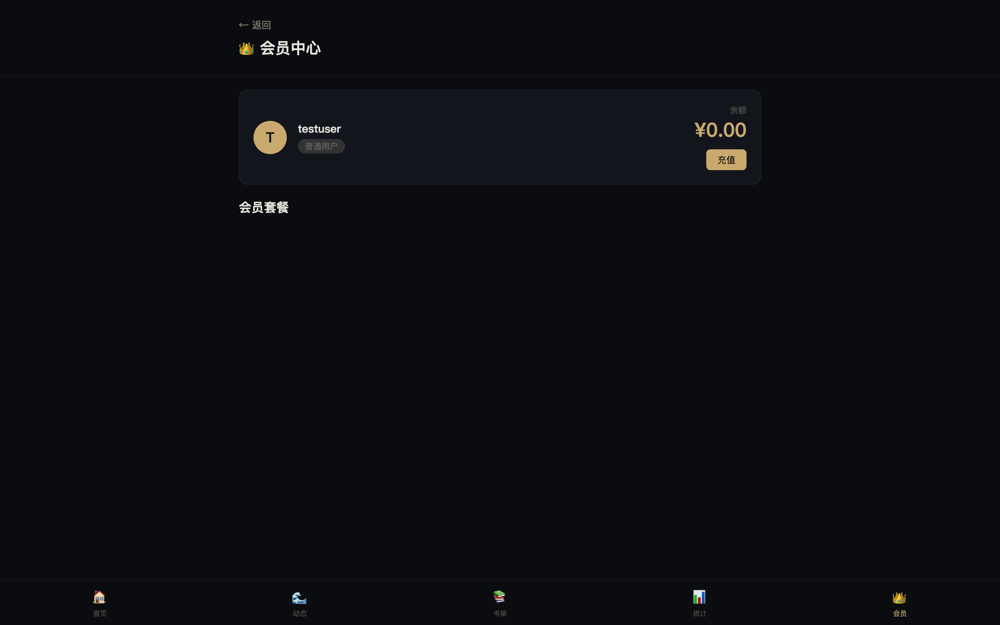

# 墨卷 — 网文小说阅读平台

> 微信读书风格的沉浸式网文阅读平台 | Vue 3 + FastAPI + MySQL

<p align="center">
  
  
</p>

<p align="center">
  
  
</p>

<p align="center">
  
  
</p>

<p align="center">
  
  
  
</p>

---

## 功能特性

### 📖 阅读体验
- **双阅读模式**：翻页模式 + 滚动模式，自由切换
- **5 种阅读主题**：深色 / 日间 / 护眼 / 绿护目 / 夜间
- **精细设置面板**：字号(12-36px)、行距(1.2-3.5)、字体(默认/宋体/楷体)、亮度
- **划线系统**：选中文字 → 5 色高亮 → 添加想法笔记
- **阅读统计**：实时统计阅读时长、字数、连续天数

### 👤 用户系统
- **JWT 认证**：注册 / 登录 / 个人信息
- **书架管理**：收藏 / 移除作品
- **阅读进度**：自动同步，跨设备续读
- **划线本**：所有划线想法集中管理

### 🔍 发现内容
- **作品分类浏览**：按分类 / 排行 / 热门筛选
- **全文搜索**：作品名称 + 作者搜索，支持分页和排序
- **推荐系统**：基于阅读历史的个性化推荐
- **好友动态**：关注好友的阅读动态流

### 💎 付费体系
- **VIP 会员**：展示套餐和已有会员权益；新开通暂未开放
- **单章购买**：按章节付费阅读
- **月票系统**：投票支持喜欢的作品

## 技术栈

| 层级 | 技术 | 用途 |
|------|------|------|
| 前端框架 | Vue 3 (Composition API) | 响应式 UI |
| 构建工具 | Vite 5 | 开发服务器 & 构建 |
| 路由 | Vue Router 4 (History 模式) | 12 条路由 |
| HTTP | Axios | API 请求 + 拦截器 |
| 后端框架 | FastAPI | Web API (自动 OpenAPI 文档) |
| ORM | SQLAlchemy 2.0 | 数据库操作 |
| 数据库 | SQLite (开发) / MySQL 8 (生产) | 17 张数据表 |
| 认证 | JWT (HS256) | 无状态认证 |
| 部署 | Docker Compose | MySQL + Redis 容器编排 |

## 项目结构

```
novel-site/
├── backend/                  # FastAPI 后端
│   ├── app/
│   │   ├── api/              # 11 个 API 模块（50+ 端点）
│   │   │   ├── auth.py       认证系统
│   │   │   ├── works.py      作品 CRUD
│   │   │   ├── chapters.py   章节（VIP 鉴权）
│   │   │   ├── bookshelf.py  书架管理
│   │   │   ├── highlights.py 划线想法
│   │   │   ├── reading.py    阅读统计
│   │   │   ├── social.py     社交系统
│   │   │   ├── recommend.py  推荐系统
│   │   │   ├── payment.py    付费系统
│   │   │   └── admin.py      管理后台
│   │   ├── models/           SQLAlchemy 模型（17 张表）
│   │   ├── schemas/          Pydantic Schema
│   │   ├── services/         业务逻辑层
│   │   └── core/             核心配置
│   ├── seed.py               种子数据
│   └── requirements.txt
├── frontend/                 # Vue 3 前端
│   ├── src/
│   │   ├── views/            15+ 页面组件
│   │   │   ├── Reader.vue    阅读器（~1000 行，核心组件）
│   │   │   ├── Home.vue      首页
│   │   │   ├── Work.vue      作品详情
│   │   │   ├── Bookshelf.vue 书架
│   │   │   └── admin/        管理后台
│   │   ├── api/              API 封装
│   │   └── router/           路由配置（12 条）
│   └── package.json
├── screenshots/              # 页面截图
└── docker-compose.yml
```

## 快速启动

### 1. 启动数据库

```bash
docker-compose up -d
```

### 2. 启动后端

```bash
cd backend
python -m venv venv
source venv/bin/activate
pip install -r requirements.txt
uvicorn app.main:app --reload --port 8000
```

### 3. 启动前端

```bash
cd frontend
npm install
npm run dev
```

访问 http://localhost:5173 🎉

### 测试账号

| 用户名 | 密码 |
|--------|------|
| testuser | password123 |

## API 文档（50+ 端点）

启动后端后访问 http://localhost:8000/docs

### 核心接口

| 方法 | 路径 | 说明 |
|------|------|------|
| POST | /api/auth/register | 用户注册 |
| POST | /api/auth/login | 用户登录 |
| GET | /api/works | 作品列表（分页/分类/排序） |
| GET | /api/works/{id} | 作品详情 |
| GET | /api/works/{id}/chapters | 章节目录 |
| GET | /api/chapters/{id} | 章节内容（VIP 鉴权） |
| POST | /api/highlights | 创建划线/想法 |
| POST | /api/reading/heartbeat | 阅读心跳（30s） |
| GET | /api/recommend/personalized | 个性化推荐 |
| GET | /api/social/feed | 好友动态流 |
| POST | /api/payment/subscribe | 订阅会员 |

## 页面导航

| 路由 | 页面 | 说明 |
|------|------|------|
| `/` | 首页 | Hero + 分类 + 热门作品 |
| `/login` | 登录 | 用户登录 |
| `/register` | 注册 | 用户注册 |
| `/works/:id` | 作品详情 | 目录 + 书评 + 推荐 |
| `/works/:id/chapters/:cid` | 阅读器 | 核心页面，支持翻页/主题/划线 |
| `/bookshelf` | 书架 | 收藏作品管理 |
| `/search` | 搜索 | 分页 + 排序 + 安全高亮 |
| `/payment` | 会员中心 | 已有权益/余额查看（新开通及充值暂未开放） |
| `/notebook` | 划线本 | 所有划线想法 |
| `/stats` | 阅读统计 | 时长/字数/连续天数 |
| `/feed` | 好友动态 | 关注动态流 |
| `/profile/:id` | 用户主页 | 个人信息 + 书评 |
| `/admin` | 管理后台 | 数据概览 + 用户/作品管理 |

## 开发路线

### Phase 6（进行中）
- [ ] SQLite → MySQL 迁移
- [ ] Redis 缓存层
- [ ] Elasticsearch 全文搜索
- [ ] PWA 支持
- [ ] 单元测试 + E2E
- [ ] CI/CD Pipeline

### 中期规划
- [ ] WebSocket 实时通知
- [ ] API Rate Limiting
- [ ] 图片懒加载 + CDN
- [ ] 章节预加载

### 长期规划
- [ ] 微信小程序端
- [ ] 听书 / TTS 朗读
- [ ] 作者入驻 & 创作后台
- [ ] 微信支付 / 支付宝集成

## License

MIT

## 回归验证

```bash
cd backend
pip install -r requirements-dev.txt
python -m unittest discover -s tests -v
cd ../frontend
npm test
npm run build
```

测试使用独立临时数据库，不修改本地小说库。默认开发数据库为 SQLite，无需先启动 Docker；使用 MySQL 时再配置数据库服务和 `DATABASE_URL`。

### 支付与数据兼容说明

- 当前没有接入真实支付网关，充值和会员开通返回暂不可用，前端禁用对应按钮；不提供模拟到账或未验证的支付回调。
- 已有有效会员和余额可以继续使用；按章购买使用原子扣款和唯一购买记录，重复请求不会重复扣费。
- 首次启动会新增 `chapter_purchases` 表，保留已有数据。旧订单没有章节关联，不能自动推断具体已购章节，需有可靠历史凭证后再补录。
- 章节目录只返回摘要；正文、阅读进度和阅读心跳都会校验阅读权限。阅读字数属于根据进度与停留时间计算的估算值。
